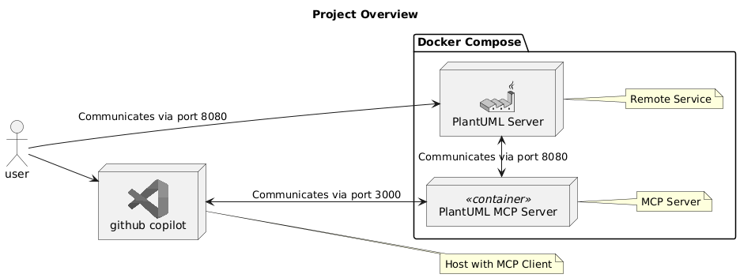
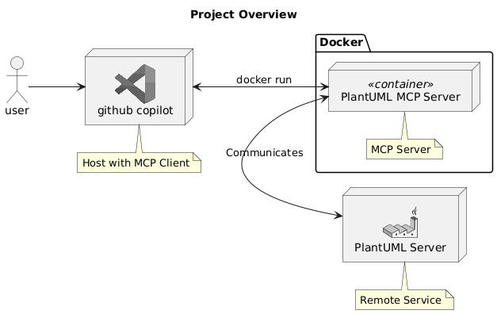

# Plantuml Validation MCP Server

This project is an MCP server for validating Plantuml code.

## Tools
### ValidatePlantuml
Validates the provided Plantuml message. If valid, it returns "Ok". If invalid, it returns detailed error information, including the error description, the line where the error occurred, and other metadata.


## Usage with SSE



### 1. Run Docker Compose
Run the following command to start the server:

```bash
docker compose up -d
```

### 2. MCP Configuration in VSCode

```json: settings.json
    "mcp": {
        "servers": {
            "my-plantuml-mcp-server": {
                "type": "sse",
                "url": "http://localhost:3000/sse"
            }
        }
    }
```

## Usage with Docker



### 1. Build and Publish the Container
```bash
cd plantuml-mcp-server-stdio
dotnet publish /t:PublishContainer
```

### 2. MCP Configuration in VSCode

```json: settings.json
    "mcp": {
        "servers": {
            "my-plantuml-mcp-server-docker": {
                "type": "stdio",
                "command": "docker",
                "args": [
                    "run",
                    "--rm",
                    "-i",
                    "--network=host",
                    "plantuml-mcp-server-stdio",
                    "PlantumlBaseUrl=http://your_plantuml_server/"
                ],
            },
        }
    }
```
