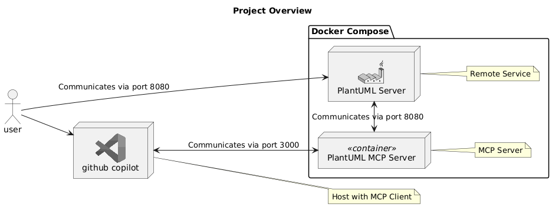

# PlantUML バリデーション MCP Server

このプロジェクトは、PlantUMLのコードをバリデーションするためのMCPサーバーです。


## ツール
### ValidatePlantUml
提供されたPlantUMLのメッセージを検証します。有効な場合は「Ok」を返します。無効な場合は、エラーの説明、エラーが発生した行、その他のメタデータを含む詳細なエラー情報を返します。


## 使用方法

### 1. Docker Compose実行
以下のコマンドを実行してサーバーを起動します。

```bash
docker compose up -d
```

### 2. VSCodeのMCP設定

```json: settings.json
    "mcp": {
        "servers": {
            "my-plantuml-mcp-server": {
                "type": "sse",
                "url": "http://localhost:3000/sse"
            }
        }
    }
```
