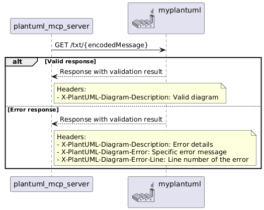

# Plantuml バリデーション MCP Server

このプロジェクトは、PlantumlのコードをバリデーションするためのMCPサーバーです。

[PlantUMLコードを検証するMCPサーバーを実装してみた](https://qiita.com/kwhrkzk/items/a7ae51aa2e00406b9c8f)

🏅 MCPHub認証済み

[このプロジェクトは MCPHub により認証されています。](https://mcphub.com/mcp-servers/kwhrkzk/plantuml-validator-mcp-server)

## ツール
### ValidatePlantuml
提供されたPlantumlのメッセージを検証します。有効な場合は「Ok」を返します。無効な場合は、エラーの説明、エラーが発生した行、その他のメタデータを含む詳細なエラー情報を返します。




## sseでの使用方法


### 1. Docker Compose実行
以下のコマンドを実行してサーバーを起動します。

```bash
docker compose up -d
```

### 2. VSCodeのMCP設定

```json: settings.json
    "mcp": {
        "servers": {
            "my-plantuml-mcp-server": {
                "type": "sse",
                "url": "http://localhost:3000/sse"
            }
        }
    }
```
## dockerでの使用方法


### 1. 
```bash
cd plantuml-mcp-server-stdio
dotnet publish /t:PublishContainer
```

### 2. VSCodeのMCP設定

```json: settings.json
    "mcp": {
        "servers": {
            "my-plantuml-mcp-server-docker": {
                "type": "stdio",
                "command": "docker",
                "args": [
                    "run",
                    "--rm",
                    "-i",
                    "--network=host",
                    "plantuml-mcp-server-stdio",
                    "PlantumlBaseUrl=http://your_plantuml_server/"
                ],
            },
        }
    }
```